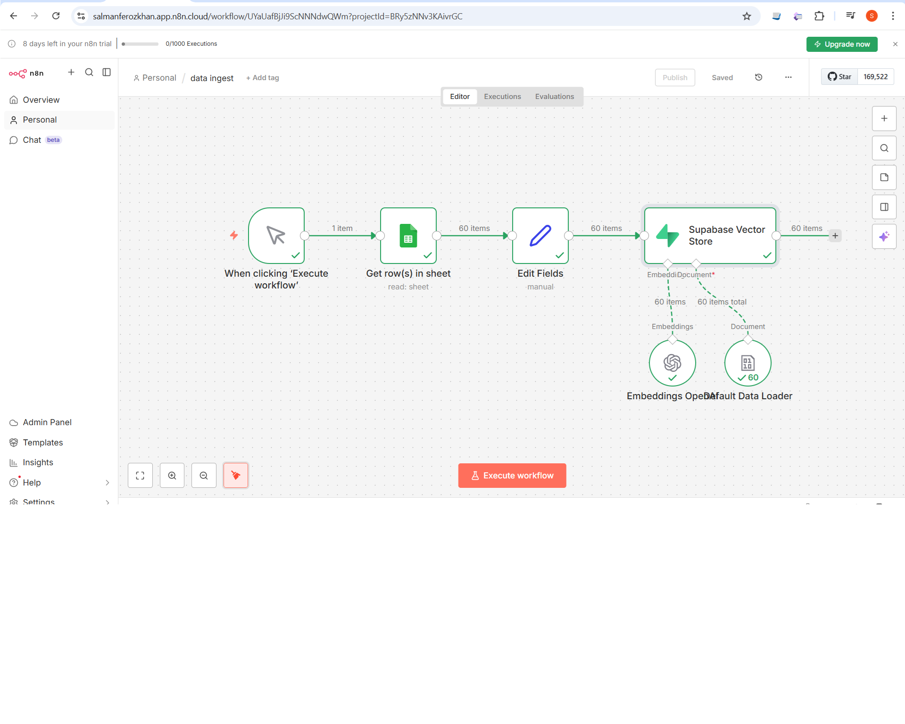
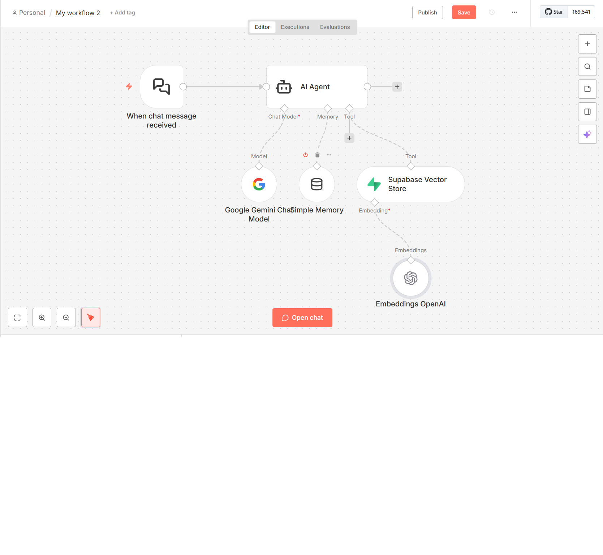

# n8n RAG System + Voice Agent

A production-ready RAG (Retrieval Augmented Generation) system built with n8n - zero code required. Now with **Voice AI** powered by ElevenLabs!

## Demo Videos

### RAG Chatbot Demo
https://github.com/Salmanferozkhan/Cloud-and-fast-api/raw/master/n8n/demo.mp4

### Voice Agent Demo (NEW!)
https://github.com/Salmanferozkhan/Cloud-and-fast-api/raw/master/n8n/voice-agent-demo.mp4

> Click the links above to download and watch the demo videos.

## Overview

This project demonstrates how to build an intelligent chatbot that answers questions using your own data, leveraging the power of:

- **n8n** - No-code automation platform
- **OpenAI Embeddings** - Vector generation
- **Supabase Vector Store** - Vector database
- **Google Gemini** - LLM for chat responses
- **ElevenLabs** - AI voice synthesis for voice agents

## Architecture

The system consists of three workflows:

### Workflow 1: Data Ingestion Pipeline



```
Google Sheets → Edit Fields → OpenAI Embeddings → Supabase Vector Store
```

| Node | Function |
|------|----------|
| When clicking 'Execute workflow' | Manual trigger |
| Get row(s) in sheet | Reads data from Google Sheets |
| Edit Fields | Transforms and processes data |
| Embeddings OpenAI | Generates vector embeddings |
| Default Data Loader | Loads documents |
| Supabase Vector Store | Stores vectors for retrieval |

**Result:** 60 documents ingested with one click.

### Workflow 2: RAG Chat Agent



```
Chat Trigger → AI Agent → Response
                  ↓
         Google Gemini (LLM)
         Simple Memory (Context)
         Supabase Vector Store (Retrieval)
         OpenAI Embeddings (Query)
```

| Node | Function |
|------|----------|
| When chat message received | Chat trigger |
| AI Agent | Orchestrates the RAG pipeline |
| Google Gemini Chat Model | LLM for generating responses |
| Simple Memory | Maintains conversation context |
| Supabase Vector Store | Retrieves relevant documents |
| Embeddings OpenAI | Converts queries to vectors |

### Workflow 3: Voice Agent (NEW!)

```
Phone Call → ElevenLabs Voice → RAG Retrieval → AI Response → Voice Output
```

| Component | Function |
|-----------|----------|
| ElevenLabs | Natural voice synthesis |
| RAG Pipeline | Knowledge retrieval from your data |
| n8n | Workflow orchestration |

**Features:**
- Answers phone calls automatically
- Speaks like a human using ElevenLabs
- Retrieves answers from your knowledge base (RAG)
- Works 24/7 without breaks

## Tech Stack

| Technology | Purpose |
|------------|---------|
| n8n | Workflow automation |
| Google Sheets | Data source |
| OpenAI | Embeddings generation |
| Supabase | Vector database |
| Google Gemini | Chat model |
| ElevenLabs | Voice AI synthesis |

## Benefits

- **No Code Required** - Drag, drop, connect
- **Production Ready** - Scalable architecture
- **Fast Setup** - Build in minutes, not weeks
- **Cost Effective** - Pay only for API usage
- **Flexible** - Easy to modify and extend

## Getting Started

1. Set up n8n (cloud or self-hosted)
2. Configure API credentials:
   - OpenAI API Key
   - Supabase credentials
   - Google Gemini API Key
   - Google Sheets access
   - ElevenLabs API Key (for voice agent)
3. Import the workflows
4. Run data ingestion first
5. Start chatting with your RAG agent

## Use Cases

- Customer support chatbots
- Internal knowledge base Q&A
- Document search and retrieval
- FAQ automation
- Research assistants
- **Voice AI phone agents**
- **Automated call handling**
- **24/7 voice support**

## Acknowledgments

Thanks **Ed Donner** for the great course!

## License

MIT
